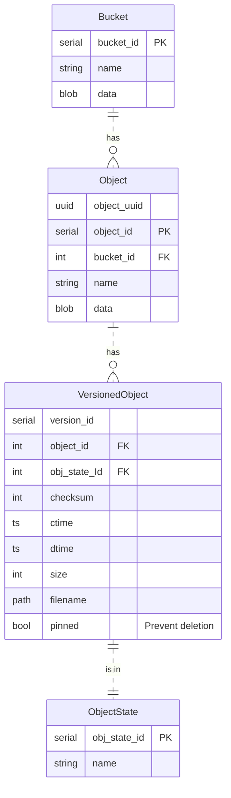
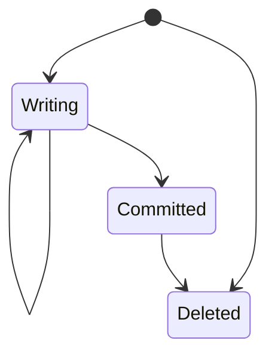

# SFS SAL Backend Design

## Context and Problem Statement

Broader SFS design. Follow up ADRs will go into depth; this is for
breadth.

## Decision Drivers

* Assume NVMe-alike storage technology. High parallelism, similar
  access latency over all blocks.
* Versioning: Every object will have multiple versions.
* Files on disk are immutable once committed.
* Easy querying of bucket, object and version data using SQL.
* Simplicity
* Leave room to grow: Keep sharding to multiple SQLite databases in mind.

## Decision Outcome

### Data and Metadata

Data is the payload submitted in PUT requests by the user.

Metadata consists of S3 metadata (atime, names) and internal metadata
(object path on disk, version id).

Metadata lives in SQLite databases; Data in files on disk.

### Data Layout

Store object data on a standard Linux filesystem like XFS or ext4.

Identify objects by UUID assigned on create. Use version 4, random UUIDs.

Use a multi level directory tree based on the object UUID to address
object data files on the filesystem. Use two one byte / two hex char
levels. For example, map UUID `683600a-b6c4-4760-a083-5f1a65ab8e95`
`/36/83/600ab6c44760a0835f1a65ab8e95`.

### Metadata Model

We store most RGW metadata using the Ceph encoder in blobs, as
exemplified with *data* in the ER diagram. We extract values to
columns if we need to query them.

### Object State Machine

Object versions follow a state machine. When created by upload they
start in *writing* and once all data is on disk reach *committed*.
Multipart uploads stay in *writing* until the user uploaded all parts, then
reach *committed*. Committed versions are available for download.
Versions may immediately reach deleted when issuing a DELETE to an
object or from *committed* when deleting an existing version.

Deletion is generally soft and follows garbage collection and
retention rules.

Keeping a *writing* state allows us to fail uploads when they don't
reach *committed* after a timeout.

### Last Object Version

Use max(version_id) in state committed of selected object.
