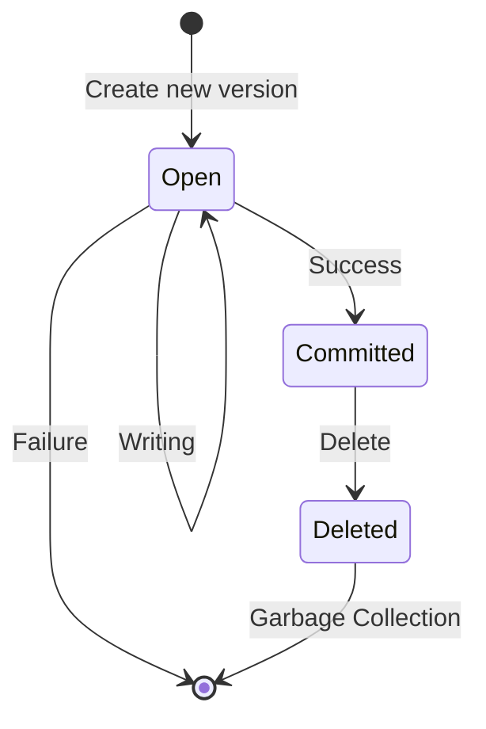

# SFS Versioning

Refines ADR 0003-SFS on the object state machine and database columns.

## Database

In this document we only look at tables Objects and Versioned Objects.

An *object* has a name, id, and reference to a *bucket*

A *object version* has an id, checksum, \{create, commit, delete\}_time,
mtime, size, **state**, **type**, ETag, serialized attributes, etc.

An *object* is a group of versions identified by bucket and name.

An *object* has one or more *object versions*. Regardless of the bucket versioning setting.

Object **state** is an enum of Open, Committed, Deleted. See Object State Machine.

Object **type** is an enum of Regular, Delete Marker.

## Object State Machine

*Open* - Initial state. Data is in flight. Data on disk is dirty. A
version may stay in this state if, for example, a client fails during
a PUT operation. A to be defined GC process cleans this up after a
time.

*Committed* - Upload finished. Data persisted. GETs and LIST
will return this object.

*Deleted* - Soft deletion state, but in terms of S3 permanent deletion.

*terminal state* - the row no longer exists in the database.

An object will never move back from Deleted to Committed. Deleting a
version is treated as permanent, even though it is only permanent after
the GC made it so.

State changes also change timestamps:

## Timestamps

(See ADR 11 for information on the data type we store)

Versioned objects store the following timestamps:

*commit_time* - When the object changes to *Committed* state.

*delete_time* - When the object changes to *Deleted* state.

*create_time* - Set when the row is first created in *Open* state.

*mtime* - A modification time passed to SFS. We follow the RADOS
  logic: Passed a `set_mtime` and `mtime`, we persist `set_mtime`. If
  `is_zero(set_mtime)` we take `real_clock::now()`. Return the `mtime`
  we persisted.

## Object Version Types

An object version may be of special type *delete marker*, representing
an S3 delete marker in versioned buckets.

## Garbage Collection

Input: object versions in deleted state.

Either delete single versions or delete whole objects.

In case whole objects, delete the object row if all versions are deleted.
In a transaction delete all versions, then the object.

Should a concurrent transaction add a new version either will fail on
the foreign key constraint between version and object. In the GC we
continue with the next object; in the create path we retry or let the
client retry.

## Operations

### Deletion

Deleting a version is not to be confused with hiding objects by adding
deletion markers. Deleting an object sets the state to DELETED.

### Hiding / Deletion Marker

A delete to a versioned bucket without a version creates a delete
marker. This hides the object and all its version from unversioned GETs
and LISTS.

SFS implements this with object versions having type delete marker. If
one exists on an object, it is excluded.

Deletion markers are object versions and follow the same state machine
and garbage collection as regular versions do. They however don't have
a size and data on the filesystem.

### Create / Update

(versioned, unversioned buckets) In a transaction:

1. Find or create an object row (id, name, bucket)
2. Create an object version in state OPEN with creation time of now.
    If versioned, use the version id provided. Otherwise generate one.

Receive and write data.

On completion:
(versioned buckets) set state COMMITTED of the previously created version. Record
checksum, size, etc.

(unversioned buckets) set state COMMITTED of the previously created version
AND set all other versions DELETED.

### Access: Listing, GETs

Many operations expect a head, null, last or "canonical" version of
an object. We define this as the *last* committed version, having the *latest*
*commit_time* timestamp.

If the timestamp resolution is too low to distinguish versions the highest id wins.

(unversioned) Since we rely on versions to implement updates, more
than one committed version may exist. We make this less likely by the commit rule in
Create / Update above. Should multiple exists, the latest is the one we use.

### Out of scope (for now): Versioning Suspended Buckets

For now SFS won't support versioning suspended buckets. Object
versions created while the bucket was unversioned or in versioning
suspended state have a 'null' version id. This is not directly
supported by this design and requires refinement in the future.
