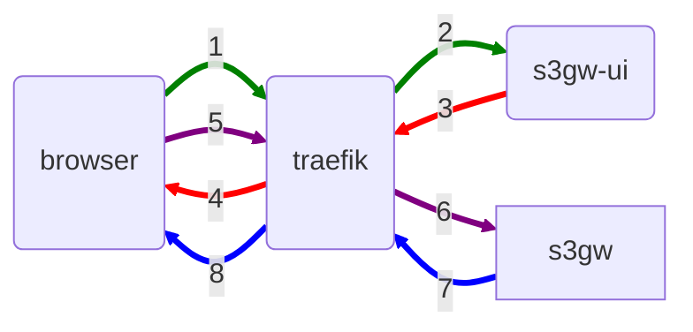
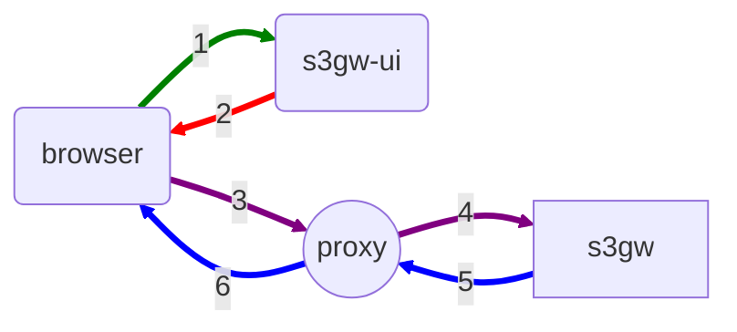
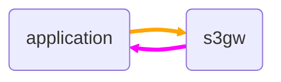
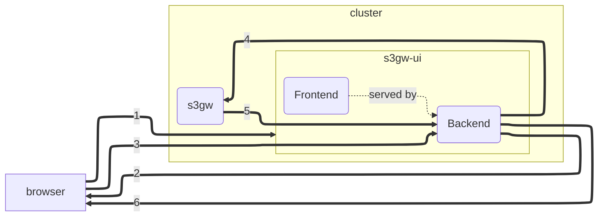
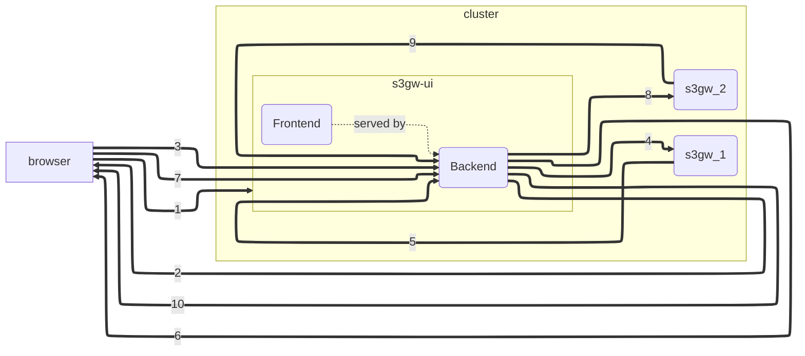

# s3gw-ui backend

## Context and Problem Statement

The current `s3gw-ui` format is as a browser application, loaded and run solely
client-side, which directly speaks to the s3gw service (RGW, henceforth known as
`s3gw`).

The diagram represents the various steps in the workings of the `s3gw-ui`. As
one can see, `traefik` is always in the middle of the communication between the
user's browser and both the `s3gw-ui` and the `s3gw` service; and we can also
see that `s3gw-ui` does not communicate directly with `s3gw`. Instead, what
happens is that during `1` and `2` we have the user's browser accessing the
`s3gw-ui` container and being presented with the `s3gw-ui` application (via `3`
and `4`); this application is then loaded by the browser, and all subsequent
actions happen client-side, without involving `s3gw-ui` (except if additional UI
resources need to be loaded). All further communication with `s3gw` is done
directly from the user's browser to the `s3gw` service (see `5`, `6`, `7`, and `8`).

### The problem with CORS

Given the `s3gw-ui` is served to the client from a different host than the one
`s3gw` is running on, we are subject to a modern browser mechanism intended to
prevent a website to load cross-origin resources from servers that do not
intend to share said resources (CORS).

While it is known how to make a web server allow cross-origin access to its
resources, in our specific case it's a non-trivial endeavor because `s3gw`
does not support a default CORS policy (other than for user-defined buckets),
and thus does not populate CORS headers that the client expects. This results
in the client refusing to allow the `s3gw-ui` from loading resources from the
`s3gw` host, culminating in a non-working (or misbehaving) `s3gw-ui`.

We have employed mitigation strategies to address this behavior. For
development purposes, we use a local webserver that both serves the frontend
and at the same time acts as a proxy to `s3gw`; resources are thus served
through this webserver, and, from the client's point of view, their origin is
in practice the same host the `s3gw-ui`'s application is being served from --
CORS does not apply in this case. For production systems, we have instead
opted to have a middleware, `traefik`, that rewrites request response headers
originating from `s3gw`, populating said response with CORS headers.

The latter scenario, the one our users rely on, poses a significant problem:
by rewriting the headers so the `s3gw-ui` is able to access the `s3gw`
resources, we are not honoring the user-specified bucket-specific CORS policies.
On the other hand, if we choose to honor those policies, we expose the `s3gw-ui`
to the possibility of being unable to administrate `s3gw` as it is supposed to.

### `s3gw` managed by other UIs (e.g., Longhorn)

As our integration with Longhorn approaches, we may want to perform a
subset of the operation `s3gw-ui` currently supports via the Longhorn UI, for
better integration. The approaches to such integration are out of the scope of
this document, but it is important to keep this in mind when choosing an option
under consideration. For instance, whether the selected option addresses the
CORS issue throughout the board; and whether the selected option may be
sustainable down the line.

### Multiple `s3gw` instances managed by the same `s3gw-ui`

As we move closer to production environments, we will likely be expected to have
multiple `s3gw` instances in the same cluster. While we can always have one
`s3gw-ui` instance per `s3gw` service, we should consider having one single
`s3gw-ui` able to centrally manage multiple `s3gw` service instances.

## Considered Options

With the intent to address the problems previously described, we have
considered several different options. This section describes them.

### Web Proxy

By setting a web proxy somewhere between the client and `s3gw`, for UI purposes,
we could rewrite CORS headers solely for the UI use-case. However, it's not
clear how this could be achieved. We would likely have to target client-side
requests to a different address than the one `s3gw` lives in, proxying the
requests to the `s3gw` service then.

While this could potentially solve the CORS issue for the `s3gw-ui` client's
browser, and potentially for the Longhorn UI, we could have a maintainability
issue in our hands: this option requires the latter to implement a lot of the
same logic as `s3gw-ui`. Additionally, this would require multiple proxies in
the same cluster, should we want to have the same `s3gw-ui` managing multiple
`s3gw` instances; or, at least, be able to have the same proxy differentiating
between the various `s3gw` instances while handling requests from the same
`s3gw-ui` address.

### Serving `s3gw-ui` from the same address as `s3gw`

There are two options to serve `s3gw-ui` to the user's browser from`s3gw`:

1. Modifying `RGW`'s code to support serving the UI directly; or,
2. Use something like `nginx`'s path-based routing to essentially proxy between
   the user's browser and both `s3gw-ui` and `s3gw`.

Both these options suffer from the same problems though: we would always need to
allocate a special-purpose path for the `s3gw-ui` to be served from (which would
be a special bucket when using path-based buckets), and we would still have
CORS issues when accessing vhost-based buckets (because the UI would be served
from a different vhost than the `s3gw-ui` address).

Additionally, we would be unable to manage several instances from the same
`s3gw-ui`, and we would still need to duplicate logic in the Longhorn UI.

### Always honoring CORS Headers from `s3gw`

Alternatively, instead of attempting to deal with CORS headers, we could simply
ensure `s3gw` always allowed any host from accessing its resources **except**
when a given bucket had a user-specified CORS policy. In this case, the
`s3gw-ui` would function normally, except when a given bucket's CORS policy
prevented `s3gw-ui` access.

The `s3gw-ui` could handle these cases, and simply prevent access to such a
bucket. However, we believe this defeats the purpose of `s3gw-ui` as an
administration and management tool for `s3gw`.

### Tweaking `s3gw` to honor CORS Headers except for the s3gw-ui

This option comes in line with the previous, but instead of always honoring all
the CORS headers, the `s3gw` service would reply with custom CORS headers should
the request from the client browser provide some form of identification
mechanism that would allow `s3gw` to understand the request came from `s3gw-ui`.

The main problem with this approach is that it is essentially a hack, and
obscure.

### s3gw-ui specific Backend

Another alternative is to have an `s3gw-ui`-specific backend, which acts much
like a proxy, but unlike a proxy it actually holds the logic to interact with
`s3gw`. This backend is nothing more than a web server, serving the `s3gw-ui`'s
UI (frontend) to the user's browser (`1`, `2`). Once loaded in the user's
browser, the frontend will then issue REST calls to the backend (`3`) to perform
its operations. These may trigger `s3gw` calls from the backend (`4`, `5`),
which will then reply back to the frontend (`6`).

The major benefit of this approach is that it solves CORS for us: because the
frontend is being served by the same host it is calling on to perform its
operations, the browser is not subject to `s3gw`-specific CORS policies. And the
backend is not subject to those same CORS policies because it is not a browser.

There are pros and cons about this approach though. On the cons side, we have
the need to split the logic to interact with `s3gw` from the frontend into the
backend; and we will have a new codebase to maintain. On the pros side, we not
only get rid of the CORS issue, but we can have the frontend issuing complex
operations to the backend, which will then handle their complexity. Further, by
splitting the logic to interact with `s3gw` to the backend, we can now support
managing and administrating multiple `s3gw` from the same frontend, and use a
different frontend than the one provided by `s3gw-ui` to manage `s3gw` (as long
as they interact with the `s3gw-ui` backend).

The diagram above is much like the previous diagram, but it shows two instances
of `s3gw` running on the cluster, with the user's browser being able to manage
and administrate both from the same `s3gw-ui` instance.

## Decision Outcome

Amongst the various options, the most versatile and flexible option is the
`s3gw-ui`-specific backend. Not only it allows us to circumvent the CORS issue
we have been facing, it also brings to the table more potential future
directions.

While the team is familiar with approaches and technologies for its
implementation, we are still faced with some challenges, discussed
further down.

### Technologies

Consensus was achieved around using Python as the implementation language for
the `s3gw-ui` backend, using `FastAPI` as the web framework. We have had
previous experience with both during the `Aquarium` project, and both are battle
tested, production ready technologies. For the `S3` dialect, `boto3` seems to be
the best library to rely on.

Communication between the user's browser and the `s3gw-ui` backend will be
protected by SSL, and user authentication will rely on JSON Web Tokens (JWT),
which is trivial to implement with `FastAPI`.

Depending how we choose to implement user authentication with `s3gw`, whether
directly using `AWS` credentials (current behavior) or by keeping those
credentials in the `s3gw-ui` backend and relying instead on `s3gw-ui`-specific
usernames and passwords, we may also need to have some form of data store for
secrets. This data store becomes imperative in case we are managing multiple
`s3gw` instances, given we will need to keep track of their addresses.

For the development of the `s3gw-ui` backend, we will rely on `black` for code
formatting, `pyright` as a static type checker, and `tox` with `pytest` for
tests.

### Behavior

While the current `s3gw-ui` implementations talks to `s3gw` using S3 dialect
via REST, we will now have an intermediary between the `s3gw-ui` frontend and
the `s3gw`; i.e., the `s3gw-ui` backend. In this case, it will be the `s3gw-ui`
backend that will communicate with `s3gw` using the S3 dialect, via REST, while
the `s3gw-ui` frontend will communicate with the `s3gw-ui` backend using a
specific REST API dialect, tailored to the frontend's needs.

For example, lets assume the `s3gw-ui` frotend desires to know all buckets in
the system, the number of objects, and each bucket's total size. Currently,
this means performing several different operations to `s3gw`, and processing
the results in the frontend. With the new approach, the `s3gw-ui` frontend
will simply ask its backend for this information in one single call (e.g.,
`/bucket/statistics?buckets=all`), and it will be the `s3gw-ui` backend's
responsibility to perform the needed operations to `s3gw` to obtain the
relevant information.

### Location

The `s3gw-ui` backend should be part of the [`s3gw-ui` repository][1]. The best
approach for file organization within the repository is beyond the scope of this
document.

### Challenges

The main challenge will be to implement the backend from scratch, ensure its
correctness, and create a new testing pipeline, as our commitment deadlines
approaches.

Additionally,

1. While `FastAPI` packages are now available for openSUSE Tumbleweed, they are
   not available for openSUSE Leap, on which our container builds are based. We
   will have to rely on installing from the Python Package Index (PyPI).
2. Because the `s3gw-ui` frontend no longer communicates directly with `s3gw`,
   and the `s3gw-ui` backend requires user credentials to perform operations in
   `s3gw`, we will have to find a way to pass the user's credentials to the
   `s3gw-ui` backend.
3. When managing multiple `s3gw` instances, different `s3gw` instances may have
   (and should have) different credentials and users. We will need to decide
   how user credentials should be handled and managed, especially for
   administrator roles that are intended to manage and administrate multiple
   `s3gw` instances.

[1]: https://github.com/aquarist-labs/s3gw-ui/
