# High Availability with s3gw

- [High Availability with s3gw](#high-availability-with-s3gw)
  - [Active-Active pipelines](#active-active-pipelines)
  - [Active-Passive pipelines](#active-passive-pipelines)
  - [One Active pipeline](#one-active-pipeline)
  - [Investigation's Rationale](#investigations-rationale)
  - [Failure cases](#failure-cases)
    - [radosgw's POD failure](#radosgws-pod-failure)
    - [Cluster's node failure](#clusters-node-failure)
    - [radosgw's failure due to a bug not related to a certain input pattern](#radosgws-failure-due-to-a-bug-not-related-to-a-certain-input-pattern)
    - [radosgw's failure due to a bug related to a certain input pattern](#radosgws-failure-due-to-a-bug-related-to-a-certain-input-pattern)
    - [PV Data corruption at application level due to radosgw's bug](#pv-data-corruption-at-application-level-due-to-radosgws-bug)
    - [PV Data corruption at application level due to radosgw's anomalous exit](#pv-data-corruption-at-application-level-due-to-radosgws-anomalous-exit)
  - [Measuring s3gw failures on Kubernetes](#measuring-s3gw-failures-on-kubernetes)
  - [The s3gw Probe](#the-s3gw-probe)
  - [Tested scenarios](#tested-scenarios)
    - [EXIT-1, 10 measures](#exit-1-10-measures)
    - [EXIT-0, 10 measures](#exit-0-10-measures)
    - [Considerations on the tests performed](#considerations-on-the-tests-performed)

We want to investigate what *High Availability* - HA - means for a project like
the s3gw.

If we identify the meaning of HA as the ability to have N independent pipelines
so that the failure of some of these does not affect the user's operations,
this is something that could be not easy to achieve with the s3gw.

With pipeline we mean all the chain from the ingress to the `PV`:

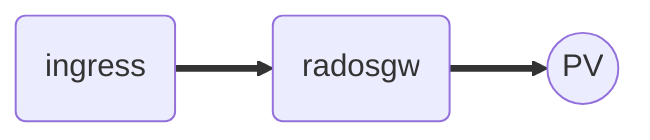

The difficulty with a project like the s3gw is due to the fact that basically
we have one process: the `radosgw`, that has the *exclusive* access to one resource:
the Kubernetes `PV` where the S3 buckets and objects are persisted.

Speaking in theory, 3 HA models are possible with s3gw:

1. **Active-Active** pipelines
2. **Active-Passive** pipelines
3. **One Active** pipeline (no Passive pipelines preloaded)

## Active-Active pipelines

This is the model that guarantees the best HA characteristics.
The *Active-Active* model must implement *true independent pipelines*
where all the pieces are replicated.

The immediate consequence of this statement is that every pipeline being part of
the same logical s3gw service must bind to a different `PV`; one per `radosgw` process.
All the `PV`s for the same logical s3gw, must therefore, sync their data.

This implies that with this model, the s3gw must implement an efficient replication
model across all the pipelines being part of the same logical service.

Under these conditions, a client accessing the S3 service would experience a failure
only for *the active operation* that were happening on the failed s3gw pipeline.

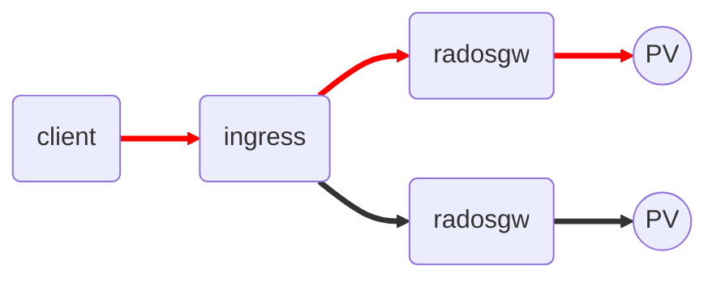

The subsequent access to the S3 service would result in a successful operation
because the load balancer would immediately reroute to another active pipeline.

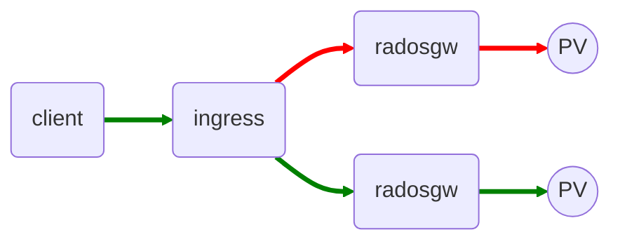

This model is potentially hugely expensive for the s3gw project
because there isn't an implementation for the data replication with the SFS backend.

## Active-Passive pipelines

This model assumes N pipelines to be "allocated" on the cluster at the same time,
but only one, the *active* pipeline, owns the *exclusive ownership*
over the shared `PV`.

Should the active pipeline suffer a failure, the next elected active pipeline,
chosen to replace the old one, should pay a *time window* necessary to "transfer"
the ownership over the shared `PV`.

This means that, unlike the *Active-Active* solution, it is not guaranteed that
the subsequent access made by a client after a failed one is always successful.

It can happen that a client issues an access to the S3 service while the system is
translating the passive pipeline into the active state; in this case, the issued
access is expected to fail.

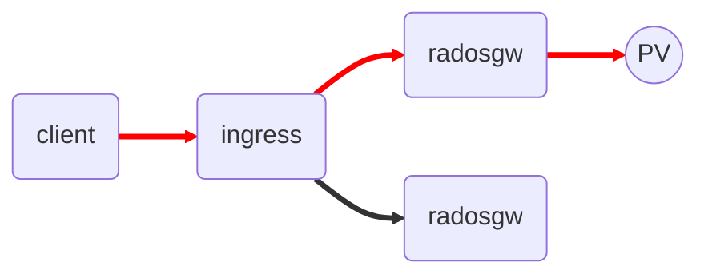

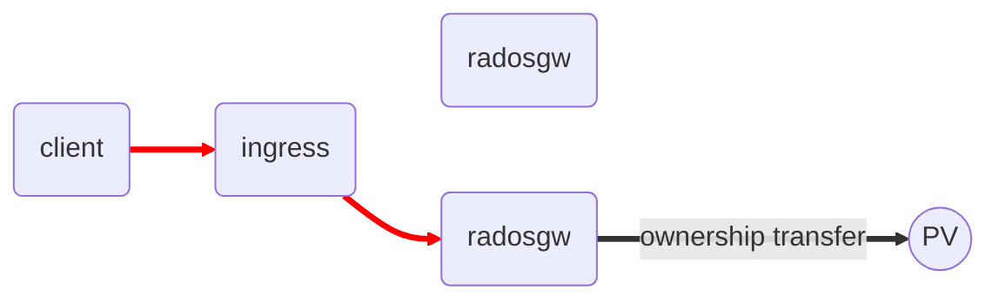

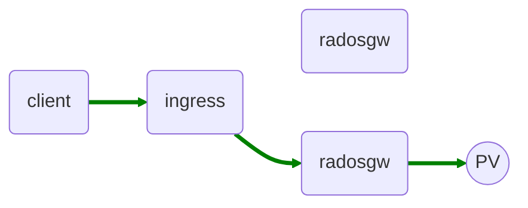

## One Active pipeline

This model is logically equivalent to the *Active-Passive* model with the difference
that only one pipeline is allocated on the cluster at a time.

In the *One pipeline* model, the only notable perceived difference between
the *Active-Passive* model are the worst performances obtained in the event of failure.

In this scenario, the system should pay also the time needed to fully load a new
pipeline, that unlike that *Active-Passive* model, is not preloaded.

So, supposing that the new pipeline has scheduled to load on a node where the
s3gw image is not cached, the system should pay the time needed to download
the image from the registry before starting it.

## Investigation's Rationale

The 3 models described above have different performances and different implementation
efforts. While the *Active-Active* model is expected to require a significant
development effort due to its inherent complex nature, the *Passive-Active* model
seems to offer a lower degree of implementation difficulty.

In particular, the *One Active pipeline* model, is expected to work with nothing
but the primitives normally available on any Kubernetes cluster.

Given that the backend s3gw architecture is composed by:

- one *stateless* `radosgw` process associated with a *stateful* `PV`

it is supposed that, on `radosgw` process failure, a simple reschedule
of its POD is enough to fulfill this simple HA model.
A clarification is needed here: the `PV` *state* is guaranteed by a third party
service, that is: **Longhorn**.

Longhorn ensures that a `PV` (along with its content) is always available on
any cluster's node, so that, a POD can mount it regardless of its allocation on the
cluster.

Relying on this assumption, while we are still in the process to decide what model
we want to actually engage, the *One Active pipeline* model seems for sure
the easiest thing to explore and to investigate.

## Failure cases

The `PV` state is kept coherent by Longhorn, so errors at this level are assumed
NOT possible (application level corruptions to the `PV`'s state ARE possible).

What are the failure cases that can happen for s3gw?

Let's examine the following scenarios:

1. `radosgw`'s POD failure or rescheduling
2. Cluster's node failure
3. `radosgw`'s failure due to a bug not related to a certain input pattern
4. `radosgw`'s failure due to a bug related to a certain input pattern
5. `PV` Data corruption at application level due to `radosgw`'s bug
6. `PV` Data corruption at application level due to `radosgw`'s anomalous exit

We are supposing all these bugs or conditions to be fatal for the s3gw's process
so that they trigger an anomalous exit.

### radosgw's POD failure

This case is when the `radosgw` process stops due to a failure of its POD.
This case applies also when Kubernetes decides to reschedule the POD
to another node, eg: when the node goes low on resources.

This can be thought as an infrastructure issue independent to the s3gw.
In this case, the *One Active pipeline* model fully restores the service by
rescheduling a new POD somewhere in the cluster.

### Cluster's node failure

This case is when the `radosgw` process stops due to a cluster's node failure.
The *One Active pipeline* model fully restores the service by
rescheduling a new POD somewhere in the cluster.

### radosgw's failure due to a bug not related to a certain input pattern

This case is when the `radosgw` process crashes due to a bug not directly
related to any input type.

Examples:

- Memory leaks
- Memory corruptions (stack or heap corruptions)
- Periodic operations or routines not related to an input (GC, measures,
  telemetry, etc)

For a bug like this, the *One Active pipeline* model could guarantee
the user's operations *until the next occurrence* of the same malfunctioning.

A definitive solution would be available only when a patch for the issue
has released.

### radosgw's failure due to a bug related to a certain input pattern

This case is when the `radosgw` process crashes due to a bug directly
related to a certain input type.

Examples:

- Putting Buckets with some name's pattern
- Putting Objects that have a certain size
- Performing an admin operation over a suspended user

For a bug like this, the *One Active pipeline* model could guarantee
the user's operations under the condition that the crash-triggering
input is recognized by the user and thus its submission blocked.

### PV Data corruption at application level due to radosgw's bug

This case is when the state on the `PV` corrupts due to a `radosgw`
bug.

In this unfortunate scenario, the *One Active pipeline* can hardly help.
A restart could evenly fix the problem or trigger an endless restarting loop.

The fix for this could contemplate an human intervention.
A definitive solution would be available only when a patch for the issue
is available.

### PV Data corruption at application level due to radosgw's anomalous exit

This case is when the state on the PV corrupts due to a `radosgw`
anomalous exit, eg: after a node failure.

This scenario could even be NOT possible because of the safety features
implemented on the radosgw SFS backend.

The fix for this could contemplate an human intervention.

## Measuring s3gw failures on Kubernetes

After reviewing the cases, we can say that what can be actually solved with
an HA model with s3gw is when the failure is not dependent to applicative bugs.
We can handle temporary issues involving the infrastructure that is hosting
the `radosgw` process.

So, we are mostly interested in observing and measuring the timing of
Kubernetes when a `radosgw`'s POD is being rescheduled.

Hence, The idea to collect measures regarding a series of restarts
artificially triggered on the `radosgw`'s POD.
Obtaining such measures would allow to compute some arbitrary statistics
for the time required by Kubernetes to restart the `radosgw`'s POD.

## The s3gw Probe

The `s3gw Probe` is a program developed with the purpose of collecting restart
events coming from the `radosgw` process.
The tool is acting as a client/server service inside the Kubernetes cluster.

- It acts as client vs the `radosgw` process requesting it to die.
- It acts as server of `radosgw` process collecting its `death` and `start` events.
- It acts as server of the user's client accepting configurations of restart
  scenarios to be triggered against the `radosgw` process.
- It acts as server of the user's client returning statistics over the collected
  data.

In nutshell:

- The `s3gw Probe` can be instructed to trigger `radosgw` restarts
  with a RESTful call.
- The `s3gw Probe` can be queried for statistics over the collected data.

The usage sequence for the s3gw Probe is the following:

- The user instructs the tool

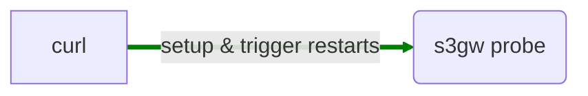

- The tool performs the `die request` cycle collecting the `death` and `start`
  events from the `radosgw` process.

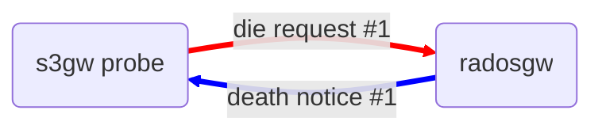

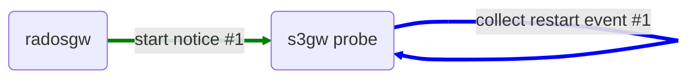

- The user queries the tool for the statistics

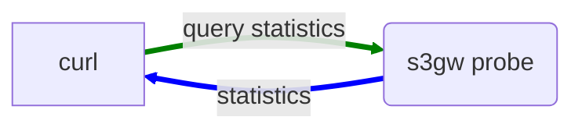

## Tested scenarios

As previously said, we want to compute some statistics regarding the Kubernetes
performances when restarting the `radosgw`'s POD.
The `radosgw` code has been patched to accept a REST call from a client
where the user can specify the way the `radosgw` will exit.
Currently, 3 modes are possible:

- `EXIT_0`
- `EXIT_1`
- `CORE_BY_SEG_FAULT`

### EXIT-1, 10 measures

```yaml
  - mark: exit1
    series:
      - restart_id: 1
        duration: 0
      - restart_id: 2
        duration: 15
      - restart_id: 3
        duration: 24
      - restart_id: 4
        duration: 42
      - restart_id: 5
        duration: 91
      - restart_id: 6
        duration: 174
      - restart_id: 7
        duration: 307
      - restart_id: 8
        duration: 302
      - restart_id: 9
        duration: 302
      - restart_id: 10
        duration: 304
    time_unit: s
```

<h1 align="left">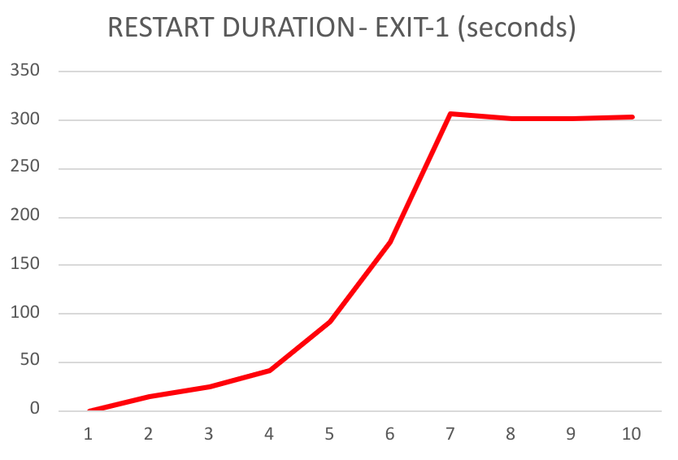
</h1>

### EXIT-0, 10 measures

```yaml
  - mark: exit0
    series:
      - restart_id: 1
        duration: 1
      - restart_id: 2
        duration: 13
      - restart_id: 3
        duration: 25
      - restart_id: 4
        duration: 49
      - restart_id: 5
        duration: 91
      - restart_id: 6
        duration: 161
      - restart_id: 7
        duration: 302
      - restart_id: 8
        duration: 304
      - restart_id: 9
        duration: 305
      - restart_id: 10
        duration: 308
time_unit: s
```

<h1 align="left">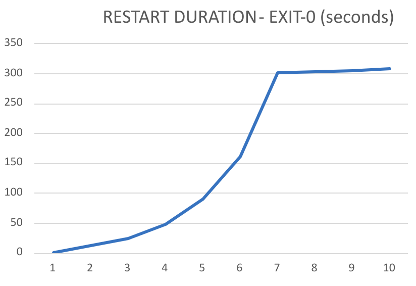
</h1>

### Considerations on the tests performed

While the Kubernetes's behavior for `EXIT-1` was the expected one, the writer
was expecting a different behavior for the `EXIT-0` test.

It is reasonable for Kubernetes to put a POD whose process exits with a code
different than zero into `CrashLoopBackoff` state; it is less obvious that the
same state is applied also for a POD whose process exits "normally".
A clarification: Kubernetes puts a POD exited with `0` into `Completed` state,
but if that POD is rescheduled, the state becomes `CrashLoopBackoff` and thus
the behavioral schema is the same as if the process run by the POD exited
abnormally.

About this behavior, there is actually an opened request to make the
[CrashLoopBackoff timing tuneable](https://github.com/kubernetes/kubernetes/issues/57291),
at least for the cases when the process exits with zero.

Anyway, this behavior limits the number of measures we can collect and thus is
preventing us to compute decent statistics on restart timings.
Currently, we can say that a `radosgw` POD restarting on the same node is taking
~1 second.
